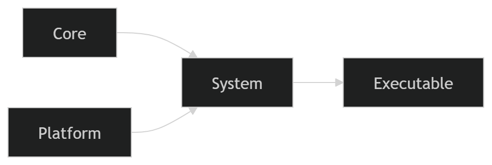

# Cleaner — Enterprise-Grade Layered C System

  
  


---

Cleaner is a **highly disciplined, enterprise-grade C project** built with professional software engineering practices in mind. Its design enforces **deterministic core logic**, strict **layered architecture**, and **automated quality checks**. Cleaner demonstrates best practices in C development for enterprise environments.

---

## 🏗 Overview

Cleaner enforces separation of responsibilities through three main layers:

- **Core Layer**: pure C logic, deterministic, no OS/platform dependencies.  
- **System Layer**: orchestrates Core, depends only on Platform abstractions.  
- **Platform Layer**: wraps OS-specific APIs, contains no business logic.  
- **Executable Layer**: links System only; System links Core + Platform.

> ✅ Unit tests, integration tests, and benchmark verification are fully separated for clarity.

---

## 1️⃣ Prerequisites

- **CMake ≥ 3.25**  
- **MinGW** (Windows)  
- **Python ≥ 3.14** (for AST checks)  
- Optional: `clang-format`, `clang-tidy`, `cppcheck`, `gcovr`, `Doxygen`

---

## 2️⃣ Configure & Build

```bash
cmake -S . -B build -G "MinGW Makefiles" -DCMAKE_EXPORT_COMPILE_COMMANDS=ON
cmake --build build

``` Quality & Analysis

  Cleaner provides 10 enterprise-grade targets for automated code quality:

  Target Description
  layer_checks AST-based architecture enforcement
  format Auto-format source via clang-format
  format_check Verify formatting compliance
  static_analysis Run clang-tidy using compile commands
  cppcheck Run static analysis via cppcheck
  docs Generate documentation with Doxygen
  coverage Produce coverage reports via gcovr
  graph Generate CMake dependency graph
  distclean Remove build artifacts
  all_quality Run all quality gates at once

  cmake --build build --target all_quality

  Ensures architecture, linting, formatting, and static analysis in one command.

``` Testing

  If ENABLE_TESTING is ON:

  cmake --build build --target run_tests

  Tests include unit, integration, and optional benchmark verification.

```Benchmarks ⚡

  Cleaner supports layer-specific benchmarks for Core, System, and Platform with Python orchestration.

  Build Benchmark Executables
  cmake --build build --target bench_core
  cmake --build build --target bench_system
  cmake --build build --target bench_platform
  Run All Benchmarks
  cmake --build build --target run_benchmarks

  Sample output:

  Running all benchmarks via Python orchestration...
  Core: 0.003412 s, wall_time=0.003423s
  System: 0.005871 s, wall_time=0.005892s
  Platform: 0.001029 s, wall_time=0.001041s

  ✅ Benchmark report saved to benchmarks/benchmark_report.json

  Sample JSON report:

  {
      "Core": {
          "reported_time": "0.003412",
          "wall_time": 0.003423
      },
      "System": {
          "reported_time": "0.005871",
          "wall_time": 0.005892
      },
      "Platform": {
          "reported_time": "0.001029",
          "wall_time": 0.001041
      }
  }
  Benchmark Principles

  Deterministic, reproducible, and platform-independent results.

  Python orchestrator ensures consistent reporting.

  Suitable for CI/CD and performance regression tracking.

  Modeled after enterprise benchmarks used in Google/FAANG-style development.

  Run full quality + benchmarks in one go:

  cmake --build build --target all_quality
  cmake --build build --target run_benchmarks

``` Installation
  cmake --install build

  Installs:

  Executable → bin/

  Static library → lib/

  Headers → include/

``` Summary

  Cleaner is a complete enterprise-grade C system with:

  Layered architecture (Core/System/Platform)

  Automated quality gates (format, lint, static analysis)

  AST-based enforcement of architecture rules

  Integrated benchmarking with JSON reports

  CI/CD-ready, reproducible builds

  Ideal reference for professional C engineering from A → Z
```

### Optional Visual Diagram

  Shows dependencies: Core & Platform feed System, System feeds Executable.
  


 information: Limiting analysis of branches. Use --check-level=exhaustive to analyze all branches. [normalCheckLevelMaxBranches]    